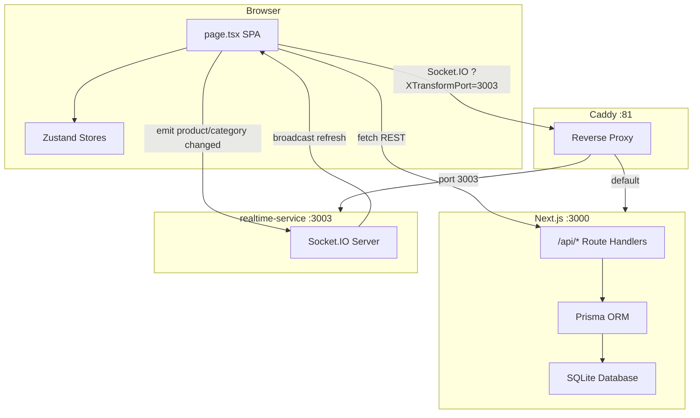
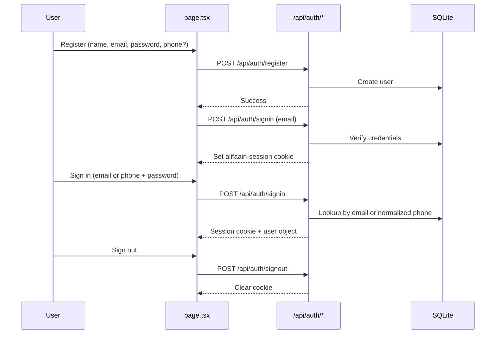
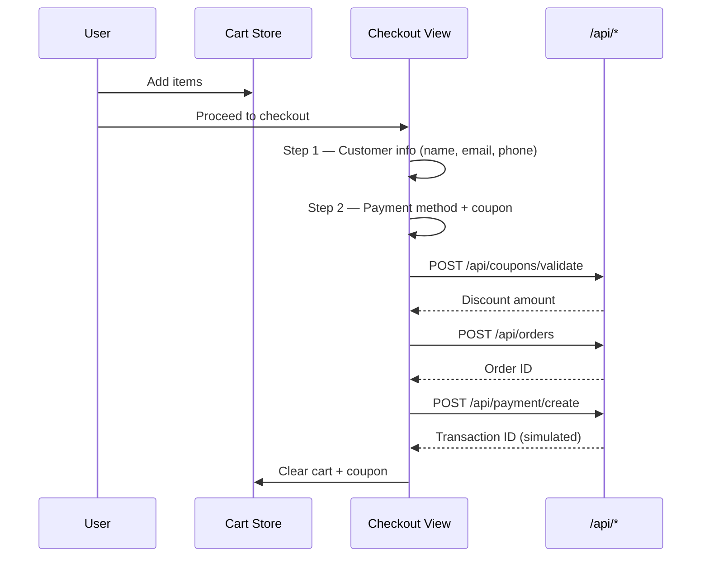
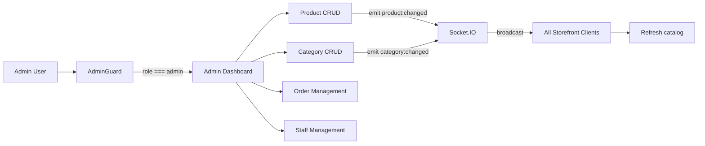
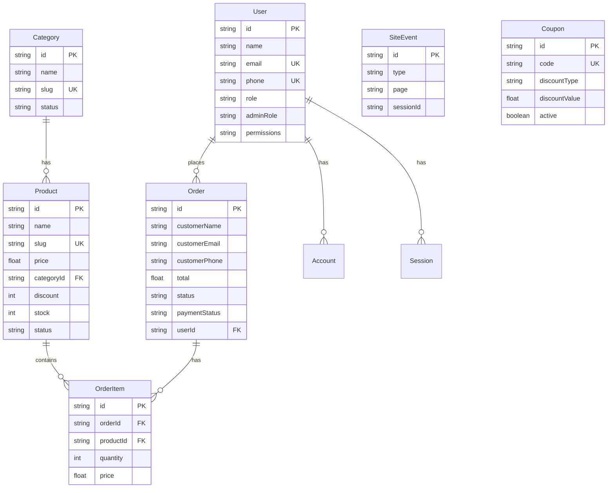

# Alifaain — Premium Beauty & Skincare

A full-stack e-commerce web application for **Alifaain**, a premium beauty and skincare brand blending authentic **Moroccan beauty traditions** with innovative **Korean skincare**. The storefront supports multi-country pricing, cart and wishlist, coupon discounts, guest and registered checkout, phone-based authentication, and a role-based admin dashboard with live catalog sync.

**Contact:** info@alifaain.com · +966 53 245 1422

---

## Table of Contents

- [Features](#features)
- [Tech Stack](#tech-stack)
- [Getting Started](#getting-started)
- [Demo Accounts](#demo-accounts)
- [Project Structure](#project-structure)
- [Architecture](#architecture)
- [Application Flows](#application-flows)
- [State Management](#state-management)
- [API Reference](#api-reference)
- [Database Schema](#database-schema)
- [Environment Variables](#environment-variables)
- [Scripts](#scripts)
- [Realtime Service](#realtime-service)
- [Deployment](#deployment)
- [Security Notes](#security-notes)
- [Screenshots](#screenshots)

---

## Features

### Storefront
- Single-page storefront with animated view transitions (home, shop, product detail, cart, wishlist, checkout, profile, about, contact)
- Product catalog with categories: Morocco, Korea, Supplements, and coming-soon categories (Clothing, Fragrances)
- Search, category filters, and price range slider
- Featured products, discounts, stock status, and multi-image product galleries
- Multi-country currency display (22 countries) with SAR as base currency
- Dark / light / system theme toggle
- Wishlist persisted in browser localStorage
- Coupon codes at checkout with validation
- Guest checkout or signed-in customer flow
- International phone input with country dial-code selector (22 countries)
- Simulated payment methods: Card, Mada, Apple Pay, Cash on Delivery

### Customer Accounts
- Register with email and optional mobile number
- Sign in with **email + password** or **mobile + password**
- Profile page: edit name, email, mobile number, change password, view order history
- Session-based auth with HTTP-only cookies (7-day expiry)

### Admin Dashboard
- Revenue charts, order stats, payment breakdown, engagement funnel (30-day analytics)
- Product CRUD with drag-and-drop image upload
- Category CRUD with status management
- Order management (status and payment status updates)
- Staff management with role-based access control (super admin only)
- Permission presets: Full Access, View Only, Update Only, Custom
- Live catalog sync to all connected clients via Socket.IO

### Analytics
- Client-side event tracking: page views, sign-in, sign-up, add-to-cart, checkout
- Stored in `SiteEvent` table and surfaced in admin dashboard

---

## Tech Stack

| Layer | Technology |
|-------|------------|
| Framework | [Next.js 16](https://nextjs.org/) (App Router, standalone output) |
| UI | [React 19](https://react.dev/), [TypeScript 5](https://www.typescriptlang.org/) |
| Styling | [Tailwind CSS 4](https://tailwindcss.com/), [shadcn/ui](https://ui.shadcn.com/) (Radix primitives) |
| Animation | [Framer Motion 12](https://www.framer.com/motion/) |
| State | [Zustand 5](https://zustand.docs.pmnd.rs/) with `persist` middleware |
| Database | [SQLite](https://www.sqlite.org/) via [Prisma 6](https://www.prisma.io/) |
| Auth | Custom session cookies (`alifaain-session`) + NextAuth route (secondary) |
| Charts | [Recharts 2](https://recharts.org/) |
| Realtime | [Socket.IO 4](https://socket.io/) (separate mini-service on port 3003) |
| Fonts | Playfair Display + Inter (Google Fonts) |
| Production runtime | Bun (standalone server) |
| Reverse proxy | [Caddy](https://caddyserver.com/) |

---

## Getting Started

### Prerequisites

- Node.js 18+ (or Bun)
- npm / bun

### Installation

```bash
# Clone the repository
git clone <repository-url>
cd AALIFAAIN

# Install dependencies
npm install

# Create environment file
cp .env.example .env   # or create .env manually (see Environment Variables)

# Push database schema
npm run setup

# Start development (two terminals)
npm run dev            # Terminal 1 — Next.js on http://localhost:3000
npm run dev:realtime   # Terminal 2 — Socket.IO on port 3003
```

On first page load, the app automatically calls `GET /api/seed` to populate categories, products, demo users, coupons, and sample analytics data if the database is empty.

### Production Build

```bash
npm run build
npm start              # Requires Bun; runs .next/standalone/server.js
```

> **Windows note:** The `build` and `start` scripts use Unix commands (`cp`, `tee`). Use Git Bash, WSL, or adapt the scripts for native Windows.

---

## Demo Accounts

| Role | Email | Password | Phone |
|------|-------|----------|-------|
| Super Admin | `admin@alifaain.com` | `admin123` | — |
| Customer | `customer@alifaain.com` | `customer123` | `+966501234567` |

### Demo Coupon Codes

| Code | Discount | Conditions |
|------|----------|------------|
| `WELCOME10` | 10% off | No minimum |
| `SAVE25` | SAR 25 off | Orders over SAR 100 |
| `ALIFAAIN15` | 15% off | Orders over SAR 150, max 100 uses |

---

## Project Structure

```
AALIFAAIN/
├── src/
│   ├── app/
│   │   ├── api/                  # REST API route handlers
│   │   ├── globals.css           # Tailwind + Alifaain theme tokens
│   │   ├── layout.tsx            # Root layout, fonts, ThemeProvider
│   │   └── page.tsx              # Entire SPA (~7,400 lines, all views)
│   ├── components/
│   │   ├── ui/                   # shadcn/ui primitives
│   │   ├── phone-input.tsx       # Country code + phone number input
│   │   └── theme-provider.tsx
│   ├── hooks/                    # use-toast, use-mobile
│   ├── lib/                      # Shared utilities
│   │   ├── auth.ts               # NextAuth config
│   │   ├── db.ts                 # Prisma client singleton
│   │   ├── session.ts            # Cookie session encode/decode
│   │   ├── password.ts           # Password hashing
│   │   ├── currency.ts           # Country/currency conversion
│   │   ├── phone.ts              # Phone validation + dial codes
│   │   ├── coupons.ts            # Coupon discount logic
│   │   ├── analytics.ts          # Client event tracking
│   │   ├── realtime.ts           # Socket.IO client
│   │   ├── seed-coupons.ts
│   │   └── seed-engagement.ts
│   └── stores/
│       ├── app-store.ts          # Navigation, cart, wishlist, coupon, country
│       └── auth-store.ts         # User session, sign in/up/out
├── prisma/
│   └── schema.prisma             # Database schema
├── mini-services/
│   └── realtime-service/         # Socket.IO broadcast server (port 3003)
├── public/
│   ├── logo.svg
│   ├── robots.txt
│   └── uploads/products/         # Runtime product image uploads
├── docs/                         # Screenshots, worklog, websocket examples
├── Caddyfile                     # Reverse proxy configuration
├── next.config.ts
├── package.json
├── tailwind.config.ts
└── components.json               # shadcn/ui configuration
```

---

## Architecture

The app uses a **single Next.js page route** (`src/app/page.tsx`) with **client-side view switching** powered by Zustand. The browser URL does not change when navigating between views — all routing is handled in memory.



### View Routing

Navigation is controlled by `useAppStore().currentView`:

```
home | products | product-detail | cart | wishlist | checkout
admin | admin-products | admin-orders | admin-categories | admin-staff
signin | signup | profile | about | contact
```

`AlifaainPage` reads `currentView.view` and renders the matching component inside `AnimatePresence` for smooth transitions.

### Bootstrap Sequence

On app mount (`page.tsx`):

1. `fetchSession()` → `GET /api/auth/session` — restore logged-in user
2. `GET /api/seed` — auto-seed database if empty
3. `GET /api/products` + `GET /api/categories` — load catalog
4. Socket.IO connects via `/?XTransformPort=3003` for live sync
5. Page views tracked via `POST /api/analytics/event`

---

## Application Flows

### Authentication Flow



- Session token is XOR-encoded JSON stored in HTTP-only cookie `alifaain-session` (7-day expiry)
- Phone numbers are normalized to E.164 format (`+966501234567`) before storage and lookup
- Profile updates via `PUT /api/auth/profile` (name, email, phone, password change)

### Checkout Flow



**Pricing rules:**
- Base prices stored in SAR
- Display prices converted via selected country exchange rate
- Free shipping on orders ≥ SAR 200, otherwise SAR 25
- COD fee: SAR 10
- Coupon discount applied before shipping

**Payment methods (simulated):**
- `card`, `mada`, `applepay` — 95% simulated success rate
- `cod` — always succeeds, payment status set to pending

### Admin Flow



**Access control:**
- `AdminGuard` requires `user.role === 'admin'`
- **Super admin** (`adminRole: super_admin`): full access including staff management
- **Sub admin**: granular JSON permissions per section (products, categories, orders, staff) with view/add/edit/delete flags

---

## State Management

All client state is managed with **Zustand** stores in `src/stores/`.

| Store | File | Persistence | Responsibility |
|-------|------|-------------|----------------|
| `useAppStore` | `app-store.ts` | `selectedCountry` only | View navigation, country selector |
| `useCartStore` | `app-store.ts` | `localStorage` (`alifaain-cart`) | Cart items, quantities, totals |
| `useWishlistStore` | `app-store.ts` | `localStorage` (`alifaain-wishlist`) | Wishlist items |
| `useCouponStore` | `app-store.ts` | `localStorage` (`alifaain-coupon`) | Applied coupon at checkout |
| `useAuthStore` | `auth-store.ts` | None (server session) | User object, sign in/up/out |

---

## API Reference

All endpoints are Next.js Route Handlers under `src/app/api/`. Unless noted, routes do **not** require authentication.

### Health

| Method | Endpoint | Description |
|--------|----------|-------------|
| `GET` | `/api` | Health check — returns `{ message: "Hello, world!" }` |

### Products

| Method | Endpoint | Description | Body / Params |
|--------|----------|-------------|---------------|
| `GET` | `/api/products` | List all products with category | — |
| `POST` | `/api/products` | Create product | `name*`, `price*`, `categoryId*`; optional: `description`, `image`, `images[]`, `featured`, `discount`, `stock`, `status` |
| `GET` | `/api/products/[id]` | Get single product | Path: `id` |
| `PUT` | `/api/products/[id]` | Update product | Path: `id`; any product fields |
| `DELETE` | `/api/products/[id]` | Delete product + order items | Path: `id` |

### Categories

| Method | Endpoint | Description | Body / Params |
|--------|----------|-------------|---------------|
| `GET` | `/api/categories` | List categories with product counts | — |
| `POST` | `/api/categories` | Create category | `name*`, `slug*`; optional: `description`, `image`, `status` |
| `GET` | `/api/categories/[id]` | Get single category | Path: `id` |
| `PUT` | `/api/categories/[id]` | Update category | Path: `id`; category fields |
| `DELETE` | `/api/categories/[id]` | Delete category (409 if products exist) | Path: `id` |

### Orders

| Method | Endpoint | Description | Body / Params |
|--------|----------|-------------|---------------|
| `GET` | `/api/orders` | List all orders (admin) | — |
| `POST` | `/api/orders` | Create order | `customerName`, `customerEmail`, `items[]`; optional: `customerPhone`, `currency`, `country`, `paymentMethod`, `couponCode` |
| `PUT` | `/api/orders` | Update order status | `orderId*`; optional: `status`, `paymentStatus` |

**Order statuses:** `pending`, `processing`, `shipped`, `delivered`, `confirmed`, `cancelled`

**Payment statuses:** `pending`, `paid`, `failed`, `refunded`

### User Orders

| Method | Endpoint | Description | Auth |
|--------|----------|-------------|------|
| `GET` | `/api/user/orders` | Orders for logged-in user | Cookie: `alifaain-session` |

### Authentication

| Method | Endpoint | Description | Body |
|--------|----------|-------------|------|
| `POST` | `/api/auth/register` | Create customer account | `name*`, `email*`, `password*` (min 6); optional: `phone` |
| `POST` | `/api/auth/signin` | Sign in | `{ email, password }` OR `{ phone, password }` |
| `POST` | `/api/auth/signout` | Sign out | — |
| `GET` | `/api/auth/session` | Get current user from cookie | — |
| `GET` | `/api/auth/profile` | Profile + order count | Cookie required |
| `PUT` | `/api/auth/profile` | Update profile / change password | `name`, `email`, `phone`, `currentPassword`, `newPassword` |
| `GET/POST` | `/api/auth/[...nextauth]` | NextAuth handler (not used by main UI) | — |

### Payments (Simulated)

| Method | Endpoint | Description | Body / Params |
|--------|----------|-------------|---------------|
| `POST` | `/api/payment/create` | Process payment | `orderId*`, `paymentMethod*`; optional: `cardLast4` |
| `GET` | `/api/payment/verify` | Lookup transaction | Query: `transactionId*` |
| `POST` | `/api/payment/refund` | Refund paid order | `orderId*`; optional: `reason` |

### Coupons

| Method | Endpoint | Description | Body |
|--------|----------|-------------|------|
| `POST` | `/api/coupons/validate` | Validate coupon code | `code*`, `subtotal*` |

Returns `{ coupon: { code, discountAmount, discountType, discountValue, description } }` on success.

### Admin

| Method | Endpoint | Description | Auth |
|--------|----------|-------------|------|
| `GET` | `/api/admin/stats` | Dashboard metrics + engagement funnel | — |
| `GET` | `/api/admin/staff` | List admin users | Super admin cookie |
| `POST` | `/api/admin/staff` | Create staff member | Super admin cookie |
| `GET` | `/api/admin/staff/[id]` | Get staff member | Super admin cookie |
| `PUT` | `/api/admin/staff/[id]` | Update staff member | Super admin cookie |
| `DELETE` | `/api/admin/staff/[id]` | Downgrade staff to customer | Super admin cookie |

### Analytics

| Method | Endpoint | Description | Body |
|--------|----------|-------------|------|
| `POST` | `/api/analytics/event` | Record site event | `type*`, `page*`, `sessionId*`; optional: `userId`, `country`, `meta` |

**Event types:** `page_view`, `sign_in`, `sign_up`, `add_to_cart`, `checkout`

### Utilities

| Method | Endpoint | Description |
|--------|----------|-------------|
| `GET` | `/api/seed` | Seed database (categories, products, users, coupons, analytics) |
| `POST` | `/api/upload` | Upload product image (multipart `file`, max 5 MB, JPEG/PNG/WebP/GIF) |
| `GET` | `/api/update-images` | Bulk-update product/category images from hardcoded maps |

---

## Database Schema

SQLite database managed by Prisma. Schema defined in `prisma/schema.prisma`.



### Models

| Model | Purpose |
|-------|---------|
| `Category` | Product categories with slug, image, status |
| `Product` | Catalog items with price (SAR), discount %, stock, multi-image JSON |
| `Order` | Customer orders with payment info, coupon, currency, country |
| `OrderItem` | Line items within an order |
| `User` | Customers and admins with optional phone, role, admin permissions |
| `Account` / `Session` / `VerificationToken` | NextAuth adapter tables |
| `SiteEvent` | Analytics events (indexed by date, type, page) |
| `Coupon` | Discount codes with usage limits and expiry |

---

## Environment Variables

Create a `.env` file in the project root:

```env
# Required
DATABASE_URL="file:./db/custom.db"

# Recommended (change in production)
NEXTAUTH_SECRET="change-me-to-a-long-random-string"
```

| Variable | Required | Description | Default |
|----------|----------|-------------|---------|
| `DATABASE_URL` | Yes | Prisma SQLite connection string | — |
| `NEXTAUTH_SECRET` | Recommended | Session token encoding + NextAuth secret | `alifaain-secret-key` (dev fallback) |
| `NODE_ENV` | Auto | Set to `production` for secure cookies | Set by runtime |

No payment gateway, SMTP, or cloud storage environment variables are needed — payments are simulated and uploads are stored locally.

---

## Scripts

| Script | Command | Description |
|--------|---------|-------------|
| `dev` | `npx next dev -p 3000` | Start Next.js development server |
| `dev:realtime` | `node mini-services/realtime-service/index.ts` | Start Socket.IO service (port 3003) |
| `postinstall` | `prisma generate` | Generate Prisma client after install |
| `setup` | `prisma db push` | Push schema to database |
| `build` | `next build && cp ...` | Production standalone build |
| `start` | `bun .next/standalone/server.js` | Run production server |
| `lint` | `eslint .` | Run ESLint |
| `db:push` | `prisma db push` | Sync schema to database |
| `db:generate` | `prisma generate` | Regenerate Prisma client |
| `db:migrate` | `prisma migrate dev` | Run migrations |
| `db:reset` | `prisma migrate reset` | Reset database |

---

## Realtime Service

A separate Socket.IO server in `mini-services/realtime-service/` enables live catalog synchronization between admin and storefront clients.

| Property | Value |
|----------|-------|
| Port | `3003` |
| Events | `product:changed`, `category:changed` |
| Client connection | `io('/?XTransformPort=3003')` |

**How it works:**

1. Admin creates/updates/deletes a product or category
2. Admin UI emits `product:changed` or `category:changed` via Socket.IO
3. Realtime service broadcasts the event to all connected clients
4. Storefront clients receive the event and refresh their product/category data

**Caddy routing:** The `Caddyfile` proxies requests with `?XTransformPort=3003` to `localhost:3003`, allowing the browser to connect through the same origin without hardcoded ports.

```bash
# Start the realtime service
npm run dev:realtime
```

---

## Deployment

### Standalone Output

`next.config.ts` is configured with `output: "standalone"` for self-contained deployment. The build script copies static assets into the standalone output directory.

### Production Checklist

1. Set `DATABASE_URL` and `NEXTAUTH_SECRET` in environment
2. Run `npm run setup` to initialize the database
3. Run `npm run build`
4. Start Next.js: `npm start` (requires Bun)
5. Start realtime service: `cd mini-services/realtime-service && npm start`
6. Configure Caddy (or equivalent reverse proxy) using the provided `Caddyfile`
7. Visit the site — database auto-seeds on first load via `GET /api/seed`

### Caddy Configuration

The included `Caddyfile` listens on port `:81`:

- **Default traffic** → reverse proxy to `localhost:3000` (Next.js)
- **Query `?XTransformPort=*`** → proxy to the specified port (e.g. `3003` for Socket.IO)

---

## Security Notes

> This application is designed as a **demo / development** storefront. The following should be addressed before production use:

- Most catalog and order mutation API routes have **no server-side authentication checks**
- Staff management and profile routes require session cookies
- Payment processing is **fully simulated** — no real payment gateway integration
- Session tokens use simple XOR encoding, not signed JWTs
- Image uploads are stored on the local filesystem without CDN or access controls
- `typescript.ignoreBuildErrors: true` is enabled in `next.config.ts`
- Change `NEXTAUTH_SECRET` to a strong random value in production
- Never commit `.env` files (covered by `.gitignore`)

---

## Screenshots

Preview images are available in `docs/screenshots/`:

| Screenshot | Description |
|------------|-------------|
| `screenshot-home.png` | Homepage hero and featured products |
| `screenshot-shop.png` | Product catalog / shop view |
| `screenshot-product-detail.png` | Product detail page |
| `screenshot-cart.png` | Shopping cart |
| `screenshot-admin.png` | Admin dashboard |
| `screenshot-dark.png` | Dark mode theme |
| `screenshot-usd-shop.png` | Multi-currency pricing (USD) |
| `screenshot-featured-products.png` | Featured products section |

---

## License

Private project. All rights reserved.
